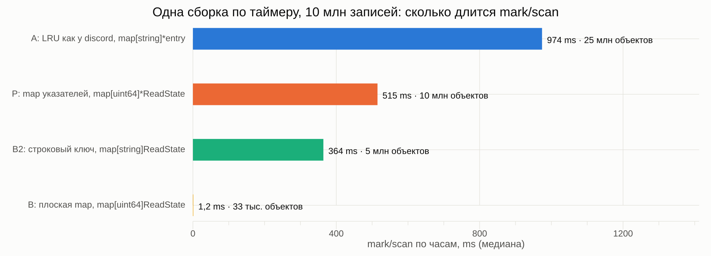
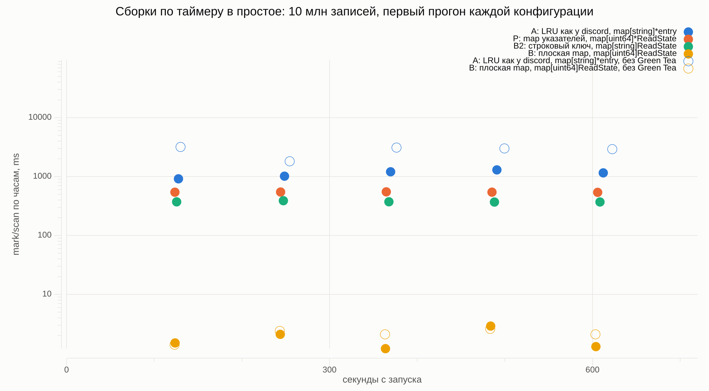
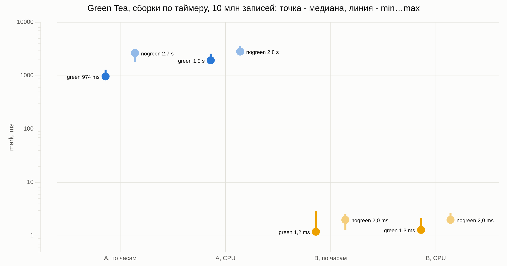

# 001 · указатели и сборка мусора: кэш на 10 млн записей

## Вопрос

Сколько времени и CPU стоит одна сборка по таймеру в Go 1.27.1, если в памяти лежит кэш на 10 млн записей: LRU на указателях против map с теми же данными без единого указателя. Отдельной строкой: что меняет Green Tea GC.

После первых прогонов вопрос расширился: добавились две промежуточные раскладки (P и B2) и быстрая серия на `runtime.GC()` от 100 тыс. до 10 млн записей, чтобы увидеть, от чего растёт цена разметки.

Страница с интерактивными графиками: https://go.faustze.tech/001-gc-pointers/

## Контекст

Если сборки не было 2 минуты, рантайм запускает её сам ([`forcegcperiod`, runtime/proc.go](https://github.com/golang/go/blob/go1.27.1/src/runtime/proc.go#L6522-L6527)). Сервис, который почти не аллоцирует, получает только такие сборки, и каждая обходит всё живое в куче. В 2020 году discord получал из-за этого спайки CPU и задержки раз в 2 минуты ([Why Discord is switching from Go to Rust](https://discord.com/blog/why-discord-is-switching-from-go-to-rust)). Замер проверяет ту же механику на текущем Go.

## Окружение

> заполняется на машине, где шли прогоны

|                                     |                              |
| ----------------------------------- | ---------------------------- |
| CPU                                 | Intel Core i7-6700 @ 3.40GHz |
| Ядра / потоки                       | 4 / 8                        |
| Память                              | 31 GiB                       |
| ОС, ядро                            | Linux 6.8.0-142-generic      |
| WSL2                                | нет, нативный Linux          |
| Go                                  | go1.27.1 linux/amd64         |
| `GOAMD64`                           | v1                           |
| `GOMAXPROCS` (поле `# P` в gctrace) | 8                            |

Окружение снимает `./articles/001-gc-pointers/run.sh env` в `logs/env.txt`. Запускать изнутри репозитория, чтобы `go version` показал тулчейн из `go.mod`.

## Гипотеза

> записана до первого прогона

**Во сколько раз mark CPU у A больше, чем у B.** На порядки. Сборка по таймеру приходит к обоим вариантам одинаково, раз в 2 минуты, но в B map без указателей помечена noscan, и mark внутрь неё не заходит. У A mark обходит около 60 млн указателей и помечает около 30 млн объектов (`entry`, `ReadState` и байты ключа на каждую запись). У B map в Go 1.24+ устроена как каталог таблиц по ≤1024 слота: на 10 млн записей это порядка 10–16 тыс. таблиц, и сборщик проходит только каталог и заголовки таблиц, десятки тысяч указателей. Массивы групп с самими парами `uint64 → ReadState` помечаются живыми без сканирования. Ещё остаются стеки, глобальные переменные и постоянные расходы цикла (две паузы STW, запуск воркеров), одинаковые для обоих вариантов. По указателям разница около 1000 раз, по миллисекундам ожидаю 100–1000 раз: у B время съедят постоянные расходы цикла.

**Сколько займёт mark для A.** Оценка: число указателей × цена проверки одного. 10 млн записей × 6 указателей = 60 млн. При 1 нс на указатель (нижняя граница, когда данные в кэше процессора) выходит 60 мс CPU. По часам примерно вдвое меньше, около 30 мс: фоновая разметка работает на 25% от 8 потоков, то есть на двух. Записи разбросаны по ~1,5 GB и в кэш процессора не влезают, так что реальное число, скорее всего, выше.

**Интервал между сборками.** Ровно 120 с: `forcegcperiod` в рантайме равен 2 минутам, и сборка запускается, если её не было дольше этого времени.

**Что поменяет Green Tea.** Для A mark подешевеет на проценты, а не в разы: указателей столько же, меняется только порядок обхода памяти. В [release notes Go 1.26](https://go.dev/doc/go1.26) команда Go ожидает снижение накладных расходов GC на 10–40% в программах, которые сильно нагружают сборщик. Ещё около 10% обещают на CPU от Intel Ice Lake и AMD Zen 4, но i7-6700 (Skylake) старше, так что эту часть не жду. Для B разницы почти не будет: сканировать там нечего.

## Методика

### Данные

Во всех вариантах одни и те же записи `ReadState` из двух полей: `LastReadID uint64` и `MentionCount uint32` (16 байт с выравниванием).

| Вариант | Как лежат записи | Указателей на запись | Объектов в куче на 10 млн |
| ------- | ---------------- | -------------------- | ------------------------- |
| A, LRU как у discord | `map[string]*entry`, ключ `strconv.Itoa(i)`. `entry` хранит `key string`, `value *ReadState`, `prev` и `next *entry`, все записи связаны в двусвязный список, как в LRU | 6: 4 в `entry` и 2 в слоте map | 25 млн |
| P, map указателей | `map[uint64]*ReadState` | 1 | 10 млн |
| B2, строковый ключ | `map[string]ReadState`, ключ `strconv.Itoa(i)` | 1: байты ключа | 5 млн (tiny allocator пакует по два коротких ключа в 16-байтный блок) |
| B, плоская map | `map[uint64]ReadState` | 0 | 33 тыс. (каталог и таблицы map) |

Вытеснения нет: кэш заполняется один раз и дальше не меняется.

### Сборки Go

| Сборка  | Команда |
| ------- | ------- |
| green   | `go build` (Green Tea включён по умолчанию) |
| nogreen | `GOEXPERIMENT=nogreenteagc go build` |

### Прогон

1. Заполнить кэш выбранного варианта.
2. Вызвать `runtime.GC()`, чтобы отсчёт таймера шёл от известной точки, и напечатать в stderr маркер `=== FILLED ... ===` с числом объектов и размером кучи из `runtime.MemStats`.
3. Режим `timer`: простой 11 минут без аллокаций (`time.Sleep`), сборки запускает только таймер. Режим `forced`: восемь вызовов `runtime.GC()` с паузой 200 ms.
4. После простоя обратиться к кэшу и вызвать `runtime.KeepAlive`, чтобы кэш оставался живым до конца прогона.

Флаги программы: `-variant` (`a`, `p`, `b2`, `b`), `-n` (число записей), `-mode` (`timer` или `forced`), `-idle` (простой в режиме `timer`), `-forced` (число `runtime.GC()`). Gctrace и маркеры программа пишет в stderr, `run.sh` перенаправляет его в `logs/<серия>/<вариант>-<сборка>-<N>.log`, поэтому строки `GODEBUG=gctrace=1` и маркеры лежат в одном файле по порядку. Максимальный RSS снимается через `/usr/bin/time -v` в `*_time.log`. Прогоны идут строго по очереди.

### Серии

| Серия | Конфигурации | Прогонов | Сборок в зачёте на прогон |
| ----- | ------------ | -------- | ------------------------- |
| `scaling` (`runtime.GC()`) | 4 варианта × 5 размеров (100 тыс., 300 тыс., 1 млн, 3 млн, 10 млн) × green/nogreen | по 1 | 7 |
| `timer` (простой 11 мин, 10 млн) | A, P, B2, B · green; A, B · nogreen | по 3 | 4 |

### Что считается

- Берутся только сборки после маркера. В серии `timer` перед каждой такой сборкой gctrace печатает строку `GC forced`: это значит, что сборку запустил таймер. Парсер проверяет это для каждой сборки.
- Первая сборка после маркера в каждом прогоне прогревочная и в итог не идёт.
- Поля строки `gctrace` (`gc # @#s #%: #+#+# ms clock, #+#/#/#+# ms cpu, #->#-># MB, ...`):
  - mark, wall-clock: второе слагаемое в `ms clock`;
  - mark, CPU: assist + background + idle, три средних числа в `ms cpu`;
  - паузы STW: первое и третье слагаемые в `ms clock`;
  - живой хип: третье число в `#->#-># MB`;
  - интервал между сборками: разница соседних `@#s`.
- По каждой конфигурации считаются медиана (`gonum/stat.Quantile`, эмпирическая), минимум и максимум по всем сборкам из всех прогонов.

### Запуск

```sh
./articles/001-gc-pointers/run.sh build     # bin/gcexp-green и bin/gcexp-nogreen
./articles/001-gc-pointers/run.sh env
./articles/001-gc-pointers/run.sh scaling   # ~10 мин
./articles/001-gc-pointers/run.sh timer     # ~2,5 ч, лучше в tmux
./articles/001-gc-pointers/run.sh report    # data.json и img/*.png
```

Парсер и графики лежат в `report/`: `parse.go` разбирает логи, `plots.go` рисует PNG через `gonum/plot`. У замера свой `go.mod`: gonum/plot нужен только `report/`, сайту он не нужен. Текст статьи лежит в `index.ru.md`, числа, таблицы и графики генератор сайта берёт из `data.json` при сборке.

### Ограничения

- Программа в простое не равна сервису под нагрузкой. Замер показывает цену одной сборки, а не задержку, которую видит пользователь.
- Фоновая разметка забирает 25% от `GOMAXPROCS`, поэтому wall-clock mark зависит от числа ядер. Цифры сравниваются только внутри одного окружения.
- Серия `scaling` сделана одним прогоном на конфигурацию. Разницу green/nogreen в ней стоит читать как наблюдение, а не как результат.

## Результаты

Все сборки после маркера в серии `timer` запущены таймером: перед каждой стоит строка `GC forced`, парсер проверяет это для каждой. Полные данные по каждой сборке лежат в `data.json`, графики на [странице замера](https://go.faustze.tech/001-gc-pointers/).

### Сборки по таймеру, 10 млн записей, простой 11 минут

| Конфигурация | Прогонов | Сборок в зачёте | Интервал, с (мин / макс) | mark clock, ms (медиана / макс) | mark CPU, ms (медиана / макс) | STW макс, ms | Живой хип, MB | Max RSS, MB |
| --- | --- | --- | --- | --- | --- | --- | --- | --- |
| A · green | 3 | 12 | 120,9 / 122,2 | 974 / 1 297 | 1 949 / 2 594 | 0,058 | 1 113 | 1 378 |
| P · green | 3 | 12 | 120,5 / 120,6 | 515 / 550 | 1 030 / 1 101 | 0,038 | 441 | 544 |
| B2 · green | 3 | 12 | 120,4 / 121,7 | 364 / 389 | 728 / 778 | 0,050 | 716 | 842 |
| B · green | 3 | 12 | 120,0 / 120,0 | 1,2 / 2,9 | 1,3 / 2,2 | 0,049 | 426 | 527 |
| A · nogreen | 3 | 12 | 121,8 / 124,5 | 2 668 / 3 100 | 2 839 / 3 630 | 0,077 | 1 113 | 1 363 |
| B · nogreen | 3 | 12 | 120,0 / 120,0 | 2,0 / 2,6 | 2,0 / 2,7 | 0,074 | 426 | 523 |

### Серия `runtime.GC()`, 10 млн записей

Один прогон на конфигурацию, 7 сборок в зачёте. Размеры от 100 тыс. до 3 млн есть в `data.json` и на странице.

| Конфигурация | mark clock, ms | mark CPU, ms (медиана, мин…макс) | Объектов в куче | Живой хип, MB | CPU на объект, ns |
| --- | --- | --- | --- | --- | --- |
| A · green | 382 | 3 028 (2 951…3 156) | 25 015 418 | 1 113 | 121 |
| P · green | 150 | 1 114 (1 101…1 153) | 10 032 983 | 441 | 111 |
| B2 · green | 134 | 1 014 (992…1 059) | 5 015 427 | 716 | 202 |
| B · green | 1,2 | 1,4 (1,1…1,9) | 32 976 | 426 | 42 |
| A · nogreen | 482 | 3 846 (2 584…5 077) | 25 015 421 | 1 113 | 154 |
| P · nogreen | 102 | 797 (403…812) | 10 032 982 | 441 | 79 |
| B2 · nogreen | 87 | 688 (578…703) | 5 015 419 | 716 | 137 |
| B · nogreen | 0,75 | 3,1 (2,9…3,7) | 32 981 | 426 | 94 |







## Вывод

**Во сколько раз mark у A дороже, чем у B.** Гипотеза: от 100 до 1000 раз по миллисекундам. Факт: под таймером 1 949 против 1,3 ms CPU, около 1 500 раз; при `runtime.GC()` около 2 200 раз. Порядок совпал, число вышло на верхней границе прогноза и чуть выше.

**Сколько стоит mark для A.** Гипотеза: 60 ms CPU и около 30 ms по часам. Факт: под таймером 1,9 s CPU и 0,97 s по часам, в 30 раз больше. Модель «наносекунда на указатель» не подошла. В этом замере цену лучше объясняет число живых объектов: около 80 ns CPU на объект под таймером и 120 ns при `runtime.GC()`, это порядок промаха кэша процессора. На графике «объекты и мегабайты» все четыре варианта ложатся близко к одной линии по числу объектов в куче (серия `runtime.GC()`, один прогон на точку), а объём живого хипа цену не предсказывает: B на 426 MB размечается в 800 раз дешевле P на 441 MB.

**Строковый ключ.** B2 хранит те же значения без указателей, что и B, но ключ `string` делает map сканируемой: 1 014 ms CPU против 1,4 ms при `runtime.GC()`. Объектов у B2 5 млн на 10 млн ключей, потому что tiny allocator кладёт по два коротких ключа в один 16-байтный блок.

**Интервал между сборками.** Гипотеза: ровно 120 s. Факт: 120 s плюс длительность предыдущей сборки. У B интервал 120,0 s, у A от 120,9 до 122,2 s, у A без Green Tea до 124,5 s. Отсчёт идёт от конца сборки: `last_gc_nanotime` записывается в `gcMarkTermination` ([runtime/mgc.go](https://github.com/golang/go/blob/go1.27.1/src/runtime/mgc.go#L1437)), а проверка таймера сравнивает с ним текущее время ([там же](https://github.com/golang/go/blob/go1.27.1/src/runtime/mgc.go#L718-L719)).

**Green Tea.** Гипотеза: для A выигрыш в процентах, для B без изменений. Факт под таймером: у A 974 против 2 668 ms по часам (в 2,7 раза) и 1 949 против 2 839 ms CPU (в 1,5 раза). Разница между этими числами видна в gctrace. С Green Tea CPU в каждой сборке ровно вдвое больше часов, то есть работают оба фоновых воркера. Без Green Tea в 14 сборках из 15 CPU равен часам, работает фактически один. Это наблюдение этого замера, свойством Green Tea вообще его считать нельзя, причина в открытых вопросах. При `runtime.GC()` на восьми воркерах у A выигрыш около 21% по CPU, у P и B2 медиана с Green Tea выше, но это один прогон на конфигурацию, и утверждать тут нечего. У B разница 1,2 против 2,0 ms, в абсолютных числах пренебрежимая.

**Правило на пальцах.** В этом замере цена разметки примерно равна числу живых объектов, умноженному на задержку памяти: почти каждый переход по указателю в большой куче промахивается мимо кэша процессора. На i7-6700 вышло около 100 ns CPU на объект (на 10 млн записей от 39 ns у B под таймером до 202 ns у B2 при `runtime.GC()`). Константой Go GC эта цифра не является: на цену влияют ещё размер сканируемой части объекта и расположение объектов в памяти, на другом железе и других структурах число будет своим. Миллион долгоживущих объектов здесь стоит порядка 100 ms CPU на каждую сборку. Правило касается только того, что живёт долго: временные объекты к моменту сборки мёртвые, и разметка их не обходит.

**Что это значит для сервиса.** Кэш A в простое раз в две минуты занимает два логических CPU из восьми примерно на секунду. Под нагрузкой разметка делит CPU с запросами, а горутины, которые в эту секунду начнут аллоцировать, могут попасть под mark assist и заплатить за разметку сами (под нагрузкой это не мерил). Обычные значения `GOGC` и `GOMEMLIMIT` сборку по таймеру не отменяют. `GOGC=off` выключает таймер ([runtime/mgc.go](https://github.com/golang/go/blob/go1.27.1/src/runtime/mgc.go#L715-L717)), но с заданным `GOMEMLIMIT` сборки всё равно придут, когда куча дойдёт до лимита. Раскладка без указателей (B) в этом замере снимает проблему целиком: 1,2 ms на сборку при тех же данных.

**Открытые вопросы.**

- Почему без Green Tea разметка в простое почти всегда идёт на одном фоновом воркере из двух.
- Почему `sysmon` не опаздывает с запуском: в полном простое он может спать до `forcegcperiod / 2`, но у B интервал 120,02 s во всех сборках.
- Почему CPU на объект под таймером (78 ns) ниже, чем при `runtime.GC()` (121 ns). Возможное объяснение: восемь воркеров мешают друг другу на шине памяти. Не проверено.
- Держится ли выигрыш Green Tea на другом CPU: i7-6700 (Skylake) старше архитектур, для которых команда Go обещала дополнительные 10%.
